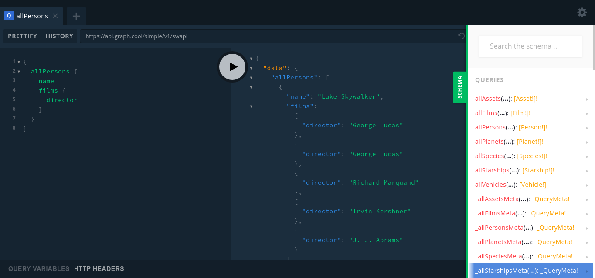

# 写了吗小程序后台 graphql版本

注：REST版本见

技术栈：golang, graphql, jwt, mongo, redis

命名：所有字段全部采用驼峰命名（含数据库和返回字段）

## 项目介绍

### 简介

针对班级作业通知的小公举，确保通知到每一位同学，作业写了吗

#### 认证：

过期时间：七天

- JWT 头部字段：Authorization ，需要前端手动在token前面加上 Bearer加空格

#### JWT认证流程：

- 前端使用 `wx.login` 拿到 微信的code
- 再使用 `wx.getUserInfo` 获取微信信息
- 调用后台 API：POST `/api/v1/login`

## 一、graphql 初体验

**官方定义：**

**A query language for your API** (API 查询语言)

GraphQL is a query language for APIs and a runtime for **fulfilling those queries with your existing data**. GraphQL provides a complete and understandable description of the data in your API, gives clients the power to **ask for exactly what they need** and nothing more, makes it easier to evolve APIs over time, and enables powerful developer tools.

个人定义：前端使用 graphql 定义的数据库语言把后端当做数据库来用

举个例子：

graphql 如下：

如果请求如下（真实开发可能有点差别）：

```
query{ 
	comment(id: "1") { 
	      title 
	      user { 
	           nickname
               email
	      } 
	}
}
```

后台一部分的类型定义如下：

```
type Comment {
  id: ID
  user: User!
  post: Post!
  title: String
  body: String!
}
```

那么将可能会返回：

```
{
  "title": "hello world",
  "user": {
    "nickname": "molscar",
    "email": "example@gmail.com",
  }
}
```

而如果使用`REST` 来发请求的话，会是这样：

```
GET /comment/1
```

## 二、graphql 和 REST的比较

RESTful 大概是这样：


那么 graphql 大概就是这样：


再给一个例子感受一下：

需求：有关电影和其出演人员的信息

+ REST

  那么可能要先GET到有关电影的信息，再根据有关电影中的出演人员的信息来GET一次演员的信息

  当然如果后台愿意额外构建一个类似`/moviesAndActors` 的接口的话，也是可以的，但是经常改需求的话，后台接口会越来越多，会很臃肿

+ GraphQL

  graphql直接使用如下查询语句即可

  ```
  query MoviesAndActors {
    movies {
      title
      image
      actors {
        image
        name
      }
    }
  }
  ```

  ​

### RESTful

优点：

- 简单
- 后端容易根据 API 进行缓存设置
- 能够通过 API 手动控制资源的权限设置
- 生态好

缺点：

+ 单个RESTful接口返回数据越来越臃肿（无法控制后台返回的数据）

+ 有时候可能需要多个请求才能获取到足够的数据

### GraphQL

优点：

+ 可以通过前端控制返回的数据 -> 数据不会臃肿

  如果：请求如下，那么只会返回评论的title，以及发评论用户的nickname和email，而不会返回用户的id等其他信息

  ```
  query{ 
  	comment(id: "1") { 
  	      title 
  	      user { 
  	           nickname
                 email
  	      } 
  	}
  }
  ```

+ 网络请求数量大减，一次请求即可获取所有资源

+ 参数类型检验，严格的类型检查能够消除一定的失误

+ 文档清晰，schema 即文档，schema定义了请求规则和返回数据

  graphql可以根据代码直接生成可视化的文档界面，界面如下：

  

  

+ 扩展性好，可以轻松应对需求变更


缺点：

- 增加了实现的复杂度

- 难以控制资源权限问题

  对于同一种资源，不同用户可能拥有不同的获取权限，这时graphql不容易控制权限

- 由于只有一个接口，后端难以控制缓存

- 暂时生态不够好

### 路由处理器和解析器

REST -> Route Handlers：

1. 服务器收到HTTP请求，提取出HTTP方法名与URL路径
2. API框架找到提前注册好的、请求路径与请求方法都匹配的代码
3. 该段代码被执行，并得到相应结果
4. API框架对数据进行序列化，添加上适当的状态码与响应头后，返回给客户端

Graphql -> Resolvers：

1. 服务器收到HTTP请求，提取其中的GraphQL查询
2. 遍历查询语句，调用里面每个字段所对应的Resolver。
3. Resolver函数被执行并返回相应结果
4. GraphQL框架把结果根据查询语句的要求进行组装（匹配）


## 附录

个人实践：https://github.com/mu-mo/phs-graphql

参考链接：

- [graphql-go](https://github.com/graphql-go/graphql)
- [graphql-go-handler](https://github.com/graphql-go/handler)
- [graphql](https://graphql.org/learn/queries/)​

学习链接：

- [官方英文文档](https://graphql.org/)
- [官方中文文档](http://graphql.cn/learn/queries/) 